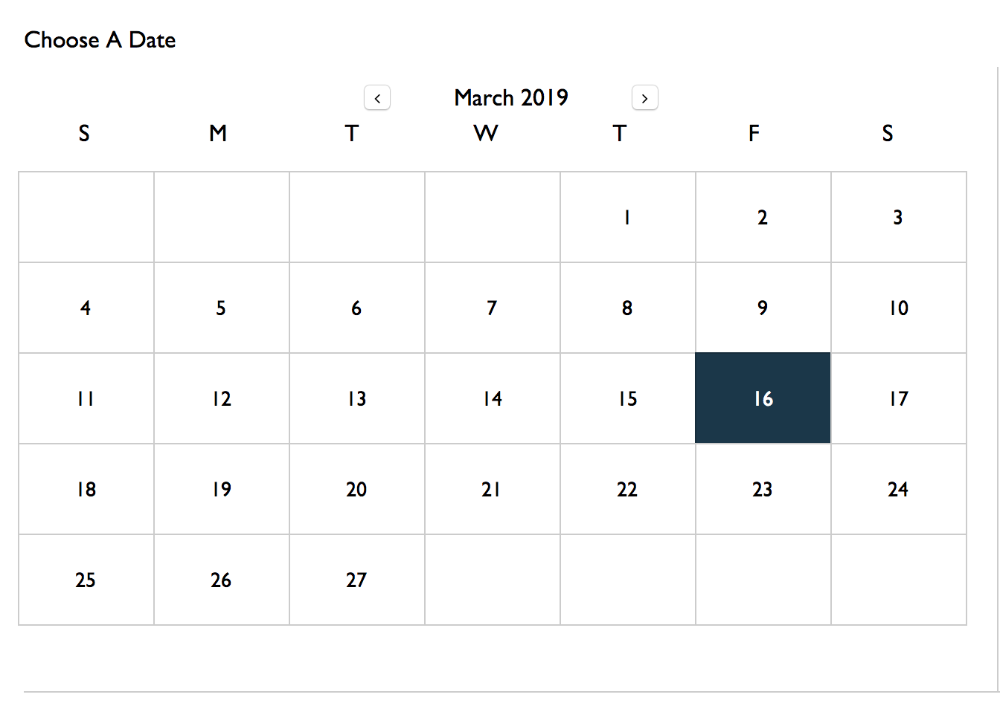

Hi Congratulation for passing the first test.
In Shopee we wish to test for several area of Frontend development,
In this test, it will highlight your ability to create ui-component and it's interaction.

To pass this test there are guidelines:
1. Don't use react-calendar, or any ui libraries. (Obviously)
2. you can use redux, but it might be faster to just use vanilla react.
3. Moment.js or any libraries that helps with Date processing is allowed but not UI libraries.

So..

The task it to create a calendar-app. Think google calendar.

The Requirement as below:
1. The calendar is monthly calendar, with 7 columns and 5/6 rows
2. The first column is monday/sunday, and the date will flow to each cell like the figure above
3. Each cell should list the date of the day
4. Do consider for leap year for february
5. It should show what is the current month and current year
6. Provide simple interaction like: 
   a. user can input a text in one cell
   b. when user mouseover over a cell, that cell will be highlighted with background-color
   c. user could use mouse-wheelup or wheeldown to change month.
7. User can switch to next month or prev month with buttons

Great to have: 
1. User can pick a month and a year randomly.
2. Sunday's date is highlighted in red.
3. make it visually stunning.